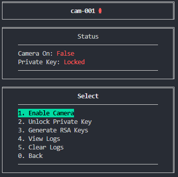
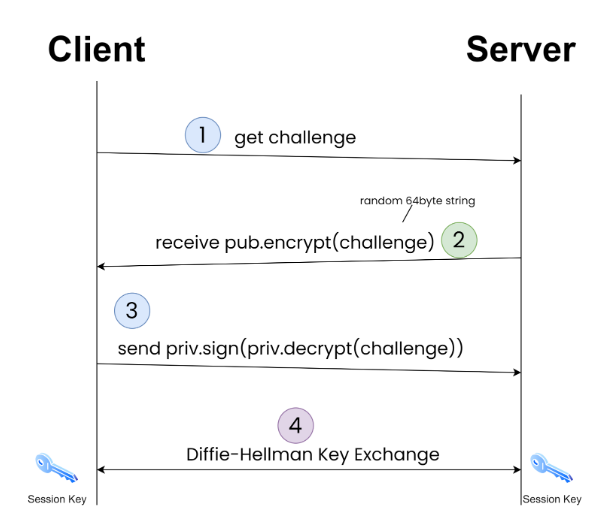
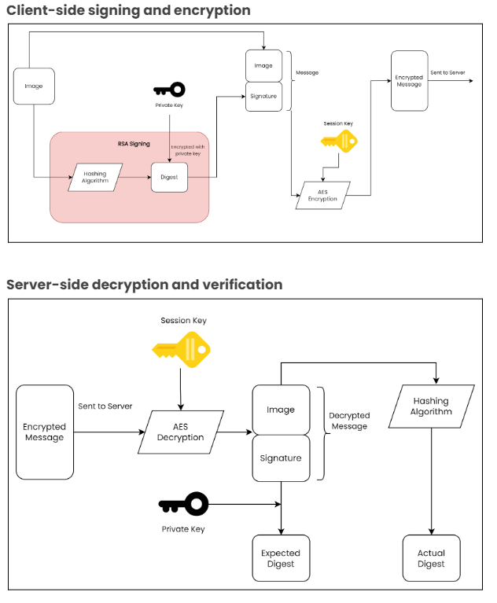

# Applied Cryptography in a Surveillance System

> ⚠️ **Disclaimer**
>
> This project is part of a school assignment. It is not intended for production use.

  
   
  Client TUI

## Overview

This codebase is a simple client-server model. The server is an FTP service and the client is a script that repeatedly sends mock surveillance captures/images. The [initial](https://github.com/ecwk/applied-cryptography-surveillance-system/compare/13c8d850a36522a5ded5df5e60899dbfa82fd9b6...main?diff=unified&w=) codebase has 0 security measures.

This project aims to apply cryptographic algorithms to secure this vulnerable surveillance system, adhering to the CIA triad.

### Implementation

A challenge-based system using RSA is implemented for authentication. Then, a shared symmetric key is generated with the Diffie-Hellman key exchange. This initial connection is part of a 4-way handshake.

  
   

Finally, Authenticated Encryption (AE) with MAC-then-Encrypt (EtM) is used to secure the data transfer and ensure the integrity of the data.

  
   

### Additional Features

- Client Text-based User Interface (TUI)
- Client logging

## Prerequisites

1. Install Python 3.9 or later
2. Install required package(s) using the command `pip install -r requirements.txt`

## To Run

### Client

1. Open another new terminal window and change directory into src/client
2. Run the command `python ./src/client/index.py` to start the client.
   - Ensure the private key is unlocked by pressing `2`. The default passphrase is `pass`, or a new keypair can be generated by pressing `3`.

### Server

1. Open a new terminal window and change directory into the src/server
2. Run the command `python ./src/server/index.py` to start the server.

## User Configuration

### Client

1. Edit `src/client/config.ini` and change the username

### Server

- Manually edit the src/admin/data/users.csv file
- (WIP) Use the web interface to add/edit/del users

## Keypairs

The keypair will be generated on the client via its GUI interface. The public key must
be located on the server prior to connection, else the server will not be able to
authenticate the client. There are several ways to transfer the keys

- Using a secure protocol, such as via SSH
- Physically, such as via USB

## Folder Structure

### Client

`auth/` - handles api calls to authd 
`controllers/` - contains flow control logic 
`keys/` - contains public key pair 
`util/` - conatins helper functions 
`views/` - contains display data for GUI 
`config.ini` - application settings 
`index.py` - main application entry-point 
`logs.txt` - camera logs 

### Server

`auth/` - handles api requests to authd 
`build/` - contain webinterface files 
`data/` - contains ftp files and userlist file, users.csv 
`models/` - allows access and manipulation to .csv files 
`util/` - contains helper functions 
`authd.py` - authorisation server logic 
`ftpd.py` - ftp server logic 
`httpd.py` - web interface server logic 
`index.py` - main application entry-point 
